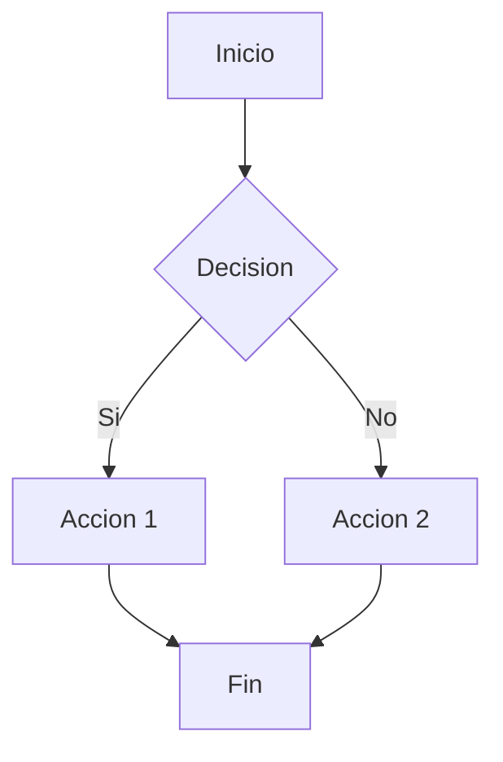
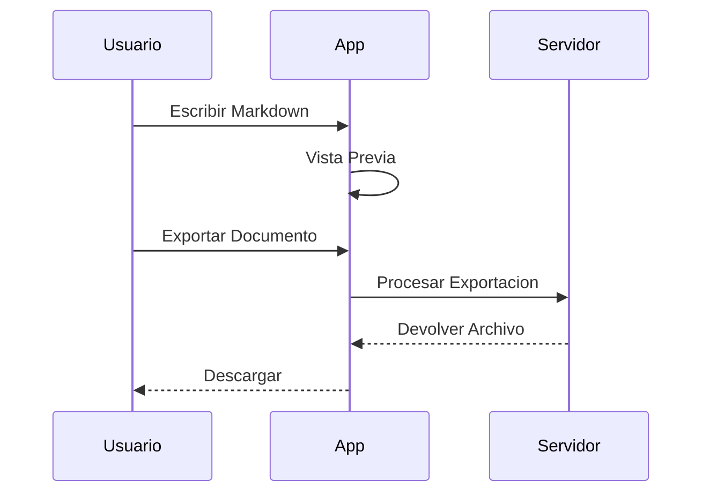
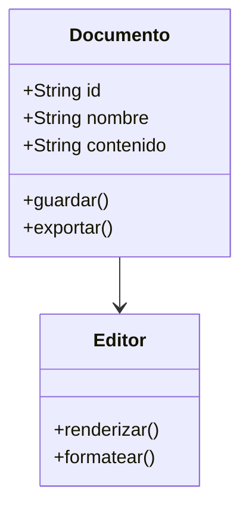

# Bienvenido a MarkView!

**MarkView** es un editor de Markdown moderno y potente con vista previa en vivo. Escribe documentacion, notas y mas con visualizacion en tiempo real.

---

## Tabla de Contenidos

1. [Primeros Pasos](#primeros-pasos)
2. [Integracion con la Nube](#integracion-con-la-nube)
3. [Sintaxis Markdown](#sintaxis-markdown)
4. [Funciones Avanzadas](#funciones-avanzadas)
5. [Opciones de Exportacion](#opciones-de-exportacion)
6. [Modos de Vista](#modos-de-vista)
7. [Atajos de Teclado](#atajos-de-teclado)
8. [Configuracion y Personalizacion](#configuracion-y-personalizacion)

---

## Primeros Pasos

### Creando Documentos

- **Nuevo Documento**: `Ctrl+N` o **Archivo > Nuevo**. El nombre del documento entrara automaticamente en modo edicion con "Sin titulo" seleccionado, y se agregara un encabezado con el nombre elegido.
- **Importar Archivos**: Arrastra y suelta archivos `.md` o usa **Archivo > Importar**
- **Multiples Pestanas**: Trabaja con varios documentos a la vez
- **Desde la Nube**: Abre archivos directamente desde GitHub o Google Drive via la barra lateral

### Guardando tu Trabajo

- **Auto-guardado**: Tus cambios se guardan automaticamente en local
- **Auto-guardado en la Nube**: Los archivos de Google Drive se guardan automaticamente despues de 30 segundos de inactividad
- **Guardar Manual**: `Ctrl+S` guarda en almacenamiento local, o en la nube (GitHub/Google Drive) segun el origen del documento
- **Historial de Versiones**: Accede a versiones anteriores haciendo **clic derecho en la pestana**

### Administrando Documentos

- **Menu Contextual**: Clic derecho en archivos para opciones: Renombrar, Duplicar, Exportar, Eliminar
- **Eliminar de la Nube**: Al eliminar archivos de la nube, elige si solo remover localmente o tambien eliminar de la nube
- **Renombrar**: Doble clic en la pestana o presiona `F2` para renombrar

---

## Integracion con la Nube

### GitHub

Conecta tu cuenta de GitHub para trabajar con tus repositorios directamente:

1. Ve a **Configuracion > Sincronizacion** y haz clic en **Conectar GitHub**
2. Autoriza a MarkView para acceder a tus repositorios
3. Explora tus repos en la seccion **GitHub** de la barra lateral
4. Abre, edita y guarda archivos markdown
5. Crea nuevos archivos con el boton **Nuevo Archivo**
6. Confirma cambios con mensajes de commit personalizados
7. Elimina archivos de los repositorios

### Google Drive

Sincroniza tus documentos con Google Drive:

1. Ve a **Configuracion > Sincronizacion** y haz clic en **Conectar Google Drive**
2. Autoriza a MarkView para acceder a tu Drive
3. Explora tus archivos en la seccion **Google Drive** de la barra lateral
4. Abre y edita archivos markdown
5. Crea nuevos archivos en cualquier carpeta (tambien puedes crear nuevas carpetas)
6. **Auto-guardado**: Los cambios se guardan automaticamente en Drive despues de 30 segundos
7. **Guardado manual**: Presiona `Ctrl+S` para guardar inmediatamente
8. **Estado de Sincronizacion**: Ve el estado en la barra de estado (Guardado, Sincronizando, Pendiente)

### Eliminando Documentos de la Nube

Cuando eliminas un documento de GitHub o Google Drive:

1. Un dialogo te preguntara que deseas hacer
2. **Solo remover de la lista**: Remueve el archivo de MarkView pero lo mantiene en la nube
3. **Tambien eliminar de la nube**: Elimina permanentemente el archivo de GitHub/Google Drive

---

## Sintaxis Markdown

### Formato de Texto

| Estilo | Sintaxis | Resultado |
|--------|----------|-----------|
| Negrita | `**texto**` | **texto** |
| Cursiva | `*texto*` | *texto* |
| Negrita y Cursiva | `***texto***` | ***texto*** |
| Tachado | `~~texto~~` | ~~texto~~ |
| Codigo en linea | `` `codigo` `` | `codigo` |

### Encabezados

```markdown
# Encabezado 1
## Encabezado 2
### Encabezado 3
#### Encabezado 4
##### Encabezado 5
###### Encabezado 6
```

### Listas

**Lista con Vinetas:**
- Primer elemento
- Segundo elemento
  - Elemento anidado

**Lista Numerada:**
1. Primer paso
2. Segundo paso
3. Tercer paso

**Lista de Tareas:**
- [x] Tarea completada
- [ ] Tarea pendiente
- [ ] Otra tarea

### Enlaces e Imagenes

```markdown
[Texto del Enlace](https://ejemplo.com)

```

### Citas

> Esta es una cita.
> Puede ocupar varias lineas.

### Linea Horizontal

Usa `---` para crear una linea separadora horizontal.

---

## Funciones Avanzadas

### Bloques de Codigo con Resaltado de Sintaxis

MarkView soporta resaltado de sintaxis para mas de 100 lenguajes de programacion:

```javascript
// JavaScript
function saludar(nombre) {
    return `Hola, ${nombre}!`;
}

const usuarios = ['Alicia', 'Bruno', 'Carlos'];
usuarios.forEach(usuario => console.log(saludar(usuario)));
```

```python
# Python
def fibonacci(n):
    if n <= 1:
        return n
    return fibonacci(n - 1) + fibonacci(n - 2)

print([fibonacci(i) for i in range(10)])
```

```typescript
// TypeScript
interface Usuario {
    id: number;
    nombre: string;
    email: string;
}

const crearUsuario = (datos: Partial<Usuario>): Usuario => ({
    id: Date.now(),
    nombre: 'Anonimo',
    email: '',
    ...datos
});
```

### Diagramas Mermaid

Crea diagramas de flujo, secuencia y mas:

**Diagrama de Flujo:**



**Diagrama de Secuencia:**



**Diagrama de Clases:**



### Formulas Matematicas (KaTeX)

Escribe ecuaciones matematicas:

**Matematica en linea:** La formula $E = mc^2$ cambio la fisica para siempre.

**Matematica en bloque:**

$$
\int_{-\infty}^{\infty} e^{-x^2} dx = \sqrt{\pi}
$$

$$
f(x) = \sum_{n=0}^{\infty} \frac{f^{(n)}(a)}{n!}(x-a)^n
$$

$$
\begin{pmatrix}
a & b \\
c & d
\end{pmatrix}
\begin{pmatrix}
x \\
y
\end{pmatrix}
=
\begin{pmatrix}
ax + by \\
cx + dy
\end{pmatrix}
$$

### Callouts

Usa callouts para resaltar informacion importante:

> **NOTA:** Contenido informativo que proporciona contexto adicional.

> **CONSEJO:** Una sugerencia util para mejorar tu flujo de trabajo.

> **ADVERTENCIA:** Informacion importante que requiere atencion.

> **IMPORTANTE:** Informacion critica que no debes pasar por alto.

> **PRECAUCION:** Procede con cuidado al seguir estas instrucciones.

### Tablas

| Funcion | Descripcion | Atajo |
|---------|-------------|-------|
| Negrita | Hacer texto negrita | `Ctrl+B` |
| Cursiva | Hacer texto cursiva | `Ctrl+I` |
| Enlace | Insertar hipervinculo | `Ctrl+K` |
| Codigo | Insertar bloque de codigo | `Ctrl+Shift+`` |

---

## Opciones de Exportacion

Exporta tus documentos en multiples formatos:

| Formato | Descripcion | Caso de Uso |
|---------|-------------|-------------|
| **Markdown** (.md) | Archivo markdown sin procesar | Compartir, control de versiones |
| **HTML** | Pagina web con estilos | Publicacion web |
| **PDF** | Documento portable | Impresion, compartir |
| **PNG** | Formato de imagen | Redes sociales, presentaciones |
| **JPEG** | Imagen comprimida | Compartir rapido |

Accede a las exportaciones via **Archivo > Exportar** o menu contextual.

---

## Modos de Vista

### Vista Dividida (Por defecto)

Ve tu editor y vista previa lado a lado. Perfecto para escribir y verificar el formato simultaneamente.

### Solo Editor

Enfocate completamente en escribir. Oculta la vista previa para edicion sin distracciones.

### Solo Vista Previa

Revisa tu documento final sin el editor visible.

### Vista Previa en Nueva Ventana

Abre la vista previa en una ventana separada. Ideal para configuraciones de dos monitores.

### Modo Zen

Presiona `F11` para una experiencia de escritura completamente libre de distracciones. Todos los elementos de la interfaz se ocultan, dejando solo tu contenido.

---

## Atajos de Teclado

### Formato de Texto

| Atajo | Accion |
|-------|--------|
| `Ctrl+B` | Negrita |
| `Ctrl+I` | Cursiva |
| `Ctrl+Shift+S` | Tachado |
| `Ctrl+`` | Codigo en linea |
| `Ctrl+Shift+`` | Bloque de codigo |

### Encabezados

| Atajo | Accion |
|-------|--------|
| `Ctrl+1` | Encabezado 1 |
| `Ctrl+2` | Encabezado 2 |
| `Ctrl+3` | Encabezado 3 |
| `Ctrl+4` a `Ctrl+6` | Encabezado 4-6 |

### Listas

| Atajo | Accion |
|-------|--------|
| `Ctrl+Shift+8` | Lista con vinetas |
| `Ctrl+Shift+7` | Lista numerada |
| `Ctrl+Shift+9` | Lista de tareas |

### Insertar Elementos

| Atajo | Accion |
|-------|--------|
| `Ctrl+K` | Insertar enlace |
| `Ctrl+Shift+I` | Insertar imagen |
| `Ctrl+Shift+Q` | Cita |

### Navegacion y Busqueda

| Atajo | Accion |
|-------|--------|
| `Ctrl+G` | Ir a linea |
| `Ctrl+F` | Buscar |
| `Ctrl+H` | Buscar y reemplazar |
| `F3` | Buscar siguiente |
| `Shift+F3` | Buscar anterior |

### Aplicacion

| Atajo | Accion |
|-------|--------|
| `Ctrl+N` | Nuevo documento |
| `Ctrl+S` | Guardar |
| `Ctrl+W` | Cerrar pestana |
| `Ctrl+B` | Alternar barra lateral |
| `Ctrl+,` | Configuracion |
| `Ctrl+/` | Atajos de teclado |
| `F11` | Modo Zen |
| `Esc` | Salir Modo Zen / Cerrar modal |

### Zoom

| Atajo | Accion |
|-------|--------|
| `Ctrl++` | Acercar |
| `Ctrl+-` | Alejar |
| `Ctrl+0` | Restablecer zoom |
| `Ctrl+Scroll` | Zoom con rueda del raton |

---

## Configuracion y Personalizacion

Accede a la configuracion via `Ctrl+,` o **Archivo > Configuracion**:

### Apariencia

- **Tema**: Claro, Oscuro, o Sistema (auto-detectar)
- **Estilo de Vista Previa**: GitHub o Por defecto
- **Tamano de Fuente**: Ajustable para editor y vista previa

### Editor

- **Auto-guardado**: Guardar cambios automaticamente
- **Formatear al Guardar**: Limpiar markdown al guardar
- **Numeros de Linea**: Mostrar/ocultar numeros de linea
- **Ajuste de Linea**: Habilitar/deshabilitar ajuste de texto

### Idioma

- English (Ingles)
- Espanol

---

## Funciones de la Barra Lateral

### Explorador de Archivos

Administra todos tus documentos abiertos. Clic derecho para opciones:
- Renombrar
- Duplicar
- Exportar Como (Markdown, HTML, Texto Plano)
- Eliminar

### Explorador de GitHub

Explora tus repositorios de GitHub:
- Selecciona repositorio y rama
- Navega por la estructura de carpetas
- Abre archivos markdown
- Crea nuevos archivos
- Elimina archivos (con commit)

### Explorador de Google Drive

Accede a tus archivos de Google Drive:
- Explora carpetas
- Abre archivos markdown
- Crea nuevos archivos (con seleccion de carpeta)
- Crea nuevas carpetas
- Elimina archivos

### Tabla de Contenidos

Navega a traves de los encabezados de tu documento. Haz clic en cualquier encabezado para saltar a esa seccion.

### Buscar y Reemplazar

- **Buscar**: Busca dentro del documento actual
- **Reemplazar**: Reemplaza una o todas las ocurrencias
- **Opciones**: Distinguir mayusculas, Expresiones regulares

---

## Consejos y Trucos

1. **Arrastrar y Soltar**: Suelta archivos `.md` directamente en el editor
2. **Gestion de Pestanas**: Clic derecho en pestanas para acciones rapidas
3. **Historial de Versiones**: Nunca pierdas tu trabajo con versionado automatico
4. **Soporte de Emojis**: Usa el selector de emojis en la barra de herramientas
5. **Encabezados Rapidos**: Usa el menu desplegable de encabezados en la barra de herramientas

---

## Proximamente

Estamos trabajando activamente en nuevas funciones:

### Gestion de Archivos Locales

- **Abrir Carpeta Local**: Abre todos los archivos markdown recursivamente desde una carpeta
- **Organizacion por Carpetas**: Organiza tus documentos locales en carpetas

### Mejoras del Editor

- **Listas de Tareas Interactivas**: Haz clic en las casillas de la vista previa para marcarlas
- **Linting de Markdown**: Deteccion de errores en tiempo real con markdownlint
- **Formateo Automatico**: Formatea tu markdown con Prettier

### Mas Integraciones en la Nube

- **Dropbox**: Sincroniza tus documentos con Dropbox
- **OneDrive**: Sincroniza con Microsoft OneDrive
- **GitLab**: Soporte para repositorios de GitLab

### Aplicacion de Escritorio

- **Aplicacion Nativa**: App basada en Tauri para Windows, macOS y Linux
- **Asociacion de Archivos**: Abre archivos `.md` directamente con MarkView
- **Actualizaciones Automaticas**: Actualizaciones automaticas cuando hay nuevas versiones

---

## Necesitas Ayuda?

- Presiona `Ctrl+/` para ver todos los atajos de teclado
- Revisa el menu **Ayuda** para el tour de funciones
- Visita nuestra [documentacion](https://github.com/qazuor/markview)

---

Feliz escritura!
