# ¡Bienvenido a MarkView! 🎉

**MarkView** es un editor de Markdown moderno y potente con vista previa en vivo. Escribe documentación, notas y más con visualización en tiempo real.

---

## Sintaxis Básica de Markdown

### Encabezados

Usa `#` para encabezados. Más símbolos `#` crean encabezados más pequeños:

```markdown
# Encabezado 1
## Encabezado 2
### Encabezado 3
```

### Formato de Texto

Haz que el texto sea **negrita**, *cursiva*, o ***ambos***:

```markdown
**texto en negrita**
*texto en cursiva*
***negrita y cursiva***
~~tachado~~
```

### Enlaces e Imágenes

Crea [enlaces](https://github.com) e inserta imágenes:

```markdown
[Texto del enlace](https://ejemplo.com)

```

---

## Resaltado de Código

MarkView soporta resaltado de sintaxis para múltiples lenguajes:

```javascript
// Ejemplo de JavaScript
function saludar(nombre) {
  console.log(`¡Hola, ${nombre}!`);
}

saludar('Mundo');
```

```python
# Ejemplo de Python
def fibonacci(n):
    if n <= 1:
        return n
    return fibonacci(n-1) + fibonacci(n-2)
```

---

## Diagramas Mermaid

Crea diagramas hermosos usando sintaxis Mermaid:

```mermaid
graph TD
    A[Inicio] --> B{¿Funciona?}
    B -->|Sí| C[¡Genial!]
    B -->|No| D[Depurar]
    D --> B
    C --> E[Fin]
```




---

## Fórmulas Matemáticas (KaTeX)

Escribe ecuaciones matemáticas hermosas usando KaTeX:

Matemática en línea: $E = mc^2$

Matemática en bloque:

$$
\int_{-\infty}^{\infty} e^{-x^2} dx = \sqrt{\pi}
$$

$$
f(x) = \sum_{n=0}^{\infty} \frac{f^{(n)}(a)}{n!}(x-a)^n
$$

---

## Callouts

Usa callouts para resaltar información importante:

> **NOTA:** Este es un callout de nota. Úsalo para información adicional.

> **ADVERTENCIA:** Este es un callout de advertencia. Úsalo para advertencias importantes.

> **CONSEJO:** Este es un callout de consejo. Úsalo para sugerencias útiles.

> **IMPORTANTE:** Este es un callout importante. Úsalo para información crítica.

---

## Listas de Tareas Interactivas

Crea listas de tareas interactivas:

- [x] Aprender sintaxis básica de Markdown
- [x] Probar resaltado de código
- [x] Crear un diagrama Mermaid
- [ ] Escribir tu primer documento
- [ ] Explorar todas las características

---

## Consejos Rápidos

### Atajos de Teclado

- **Ctrl+B**: Texto en negrita
- **Ctrl+I**: Texto en cursiva
- **Ctrl+K**: Insertar enlace
- **Ctrl+S**: Guardar documento
- **Ctrl+/**: Ver todos los atajos

### Modos de Vista

- **Vista Dividida**: Ver editor y vista previa lado a lado
- **Solo Editor**: Enfócate en escribir
- **Solo Vista Previa**: Enfócate en leer

### Características de la Barra Lateral

- **Explorador**: Administra tus documentos
- **Tabla de Contenidos**: Navega a través de los encabezados
- **Búsqueda**: Encuentra texto en todos los documentos

---

## ¿Listo para Comenzar?

1. Crea un nuevo documento desde **Archivo > Nuevo** (Ctrl+N)
2. Empieza a escribir en Markdown
3. ¡Ve cómo tu contenido cobra vida en la vista previa!

¿Necesitas ayuda? Presiona **Ctrl+/** para ver los atajos de teclado o revisa el menú de **Ayuda**.

¡Feliz escritura! ✨
