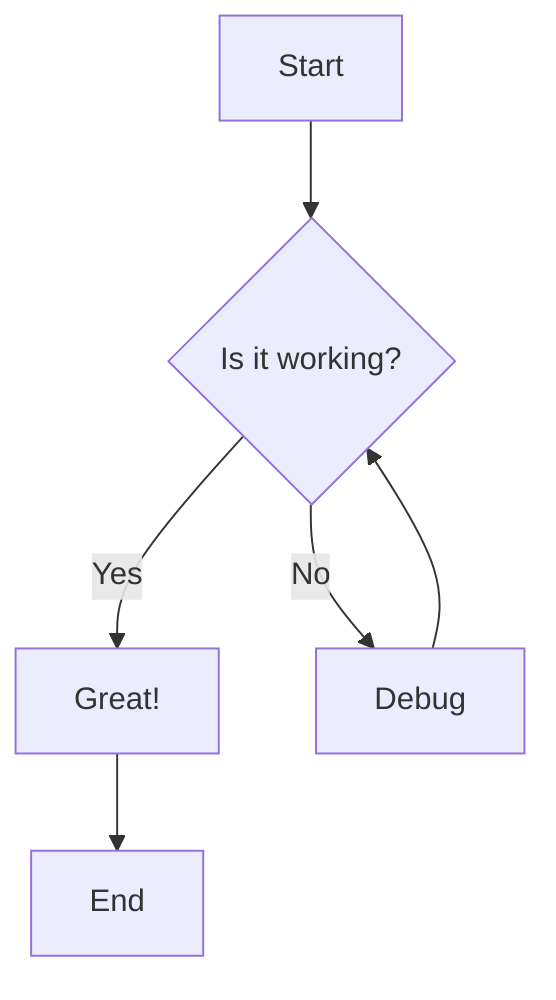
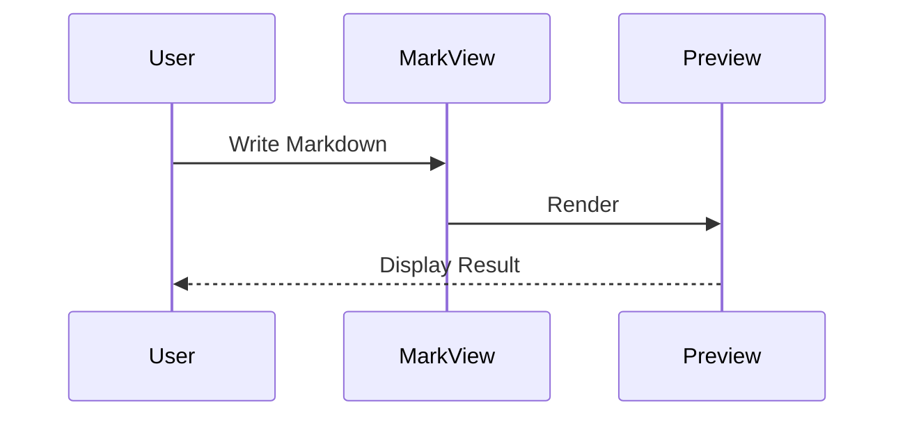

# Welcome to MarkView! 🎉

**MarkView** is a powerful, modern Markdown editor with live preview. Write beautiful documentation, notes, and more with real-time visualization.

---

## Basic Markdown Syntax

### Headings

Use `#` for headings. More `#` symbols create smaller headings:

```markdown
# Heading 1
## Heading 2
### Heading 3
```

### Text Formatting

Make text **bold**, *italic*, or ***both***:

```markdown
**bold text**
*italic text*
***bold and italic***
~~strikethrough~~
```

### Links and Images

Create [links](https://github.com) and embed images:

```markdown
[Link text](https://example.com)

```

---

## Code Highlighting

MarkView supports syntax highlighting for multiple languages:

```javascript
// JavaScript example
function greet(name) {
  console.log(`Hello, ${name}!`);
}

greet('World');
```

```python
# Python example
def fibonacci(n):
    if n <= 1:
        return n
    return fibonacci(n-1) + fibonacci(n-2)
```

---

## Mermaid Diagrams

Create beautiful diagrams using Mermaid syntax:





---

## Mathematical Formulas (KaTeX)

Write beautiful math equations using KaTeX:

Inline math: $E = mc^2$

Block math:

$$
\int_{-\infty}^{\infty} e^{-x^2} dx = \sqrt{\pi}
$$

$$
f(x) = \sum_{n=0}^{\infty} \frac{f^{(n)}(a)}{n!}(x-a)^n
$$

---

## Callouts

Use callouts to highlight important information:

> **NOTE:** This is a note callout. Use it for additional information.

> **WARNING:** This is a warning callout. Use it for important warnings.

> **TIP:** This is a tip callout. Use it for helpful suggestions.

> **IMPORTANT:** This is an important callout. Use it for critical information.

---

## Interactive Checklists

Create interactive task lists:

- [x] Learn basic Markdown syntax
- [x] Try code highlighting
- [x] Create a Mermaid diagram
- [ ] Write your first document
- [ ] Explore all features

---

## Quick Tips

### Keyboard Shortcuts

- **Ctrl+B**: Bold text
- **Ctrl+I**: Italic text
- **Ctrl+K**: Insert link
- **Ctrl+S**: Save document
- **Ctrl+/**: View all shortcuts

### View Modes

- **Split View**: See editor and preview side-by-side
- **Editor Only**: Focus on writing
- **Preview Only**: Focus on reading

### Sidebar Features

- **Explorer**: Manage your documents
- **Table of Contents**: Navigate through headings
- **Search**: Find text across documents

---

## Ready to Start?

1. Create a new document from **File > New** (Ctrl+N)
2. Start writing in Markdown
3. See your content come to life in the preview!

Need help? Press **Ctrl+/** to view keyboard shortcuts or check the **Help** menu.

Happy writing! ✨
